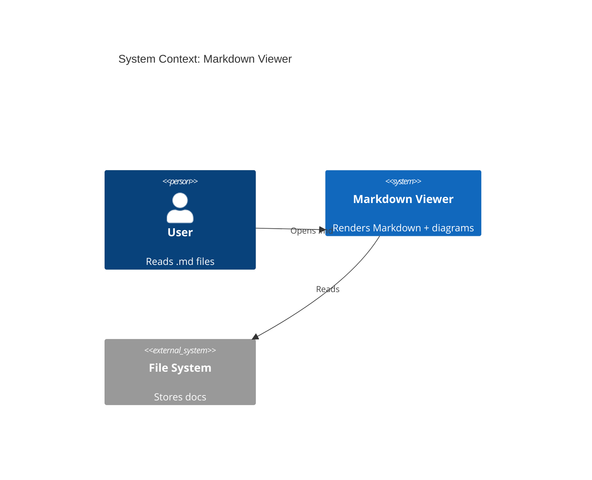

<div align="center">


# Markdown Viewer

### A native desktop markdown viewer with first-class Mermaid + C4 diagrams, KaTeX math, GitHub-style alerts, and full file/folder navigation.

<sub>© <strong>MFTLabs</strong> · Powered by <strong>CoBolt</strong> · </sub>

[](#install--macos)
[](#install--windows)
[](https://github.com/blackboardsh/electrobun)
[](LICENSE)

[](#license)
[](#license)
[](#install--macos)
[](#install--windows)
[](#license)

**Double-click any `.md` file. It just opens. With diagrams. With math. With everything.**

[Install on macOS](#install--macos) · [Install on Windows](#install--windows) · [Features](#features) · [Architecture](#architecture) · [Develop](#develop)

</div>

---

## Why this exists

You wrote a `.md` file with Mermaid diagrams, math, and a few `> [!IMPORTANT]` callouts. You double-click it. macOS opens TextEdit. Windows opens Notepad. The diagrams are raw text. The math is `$$\LaTeX$$`. You have to push to GitHub, wait for CI, and click a tab in your browser just to *read* what you wrote.

This app fixes that. It registers as the system handler for `.md`, `.markdown`, `.mdown`, `.mkd`, `.mkdn`, `.mdx` — and renders everything GitHub does, plus more, instantly, offline, with zero network calls.

## Features

<table>
<tr>
<td width="50%" valign="top">

### Markdown rendering
- ✅ **CommonMark + GFM** — tables, task lists, strikethrough, autolinks
- ✅ **Mermaid** — flowchart · sequence · class · state · gantt · pie · ER · journey
- ✅ **C4 diagrams** — Context · Container · Component · Dynamic · Deployment
- ✅ **`%%{init: ...}%%`** theme overrides honored
- ✅ **KaTeX math** — `$inline$` and `$$display$$`
- ✅ **GitHub alerts** — `[!NOTE]` `[!TIP]` `[!IMPORTANT]` `[!WARNING]` `[!CAUTION]`
- ✅ **YAML front matter** — rendered as a metadata card
- ✅ **Wikilinks** — `[[Page]]` and `[[Page|alias]]`
- ✅ **Internal links** — relative `.md` links navigate within the app
- ✅ **Relative images** — resolved against doc dir, inlined as data URLs
- ✅ **Code blocks** — language label, copy button, highlight.js syntax
- ✅ **Footnotes, emoji, attribute syntax**

</td>
<td width="50%" valign="top">

### App features
- 🗂 **Sidebar tabs** — Files · Search · Recent · Outline
- 🔎 **⌘F / Ctrl+F** — find in document with prev/next + highlight
- 🔍 **⌘⇧F / Ctrl+Shift+F** — full-text search across opened folder
- 🌳 **Filterable file tree** — instant fuzzy filter
- 🔄 **Live reload** — file watcher re-renders on save
- 👀 **Folder watcher** — new/deleted files appear automatically
- 🔍 **Mermaid lightbox** — click any diagram → zoom + pan
- 🖼 **Image lightbox** — click images to enlarge
- 🖨 **Print / Export to PDF** — system print dialog
- 📤 **Export to standalone HTML** — CSS inlined
- 📁 **Reveal in Finder / Explorer** — context menu
- 🌗 **Theme** — auto · light · dark (Mermaid theme follows)
- ⏱ **Word count + reading time** in status bar
- 📝 **Recent files** — persisted across launches
- 🪣 **Drag & drop** any `.md` file onto the window
- ✏️ **Inline editor** — toggle Edit mode for tabs + textarea editing of any text format
- 🔤 **Encoding-aware open/save** — UTF-8, UTF-16 LE/BE, Latin-1 round-trip with EOL/BOM preserved
- 💾 **Save As** — for untitled documents
- 📑 **Session restore** — open tabs reopen on next launch

</td>
</tr>
</table>

## Quick taste — try this in any markdown file

````markdown
---
title: Sample doc
status: published
---

# Hello

Inline math: $E = mc^2$. Block math:

$$\int_{-\infty}^{\infty} e^{-x^2}\,dx = \sqrt{\pi}$$

> [!IMPORTANT]
> Five flavors of GitHub alert work out of the box.



A wikilink to [[Architecture]] resolves against the open folder.
````

---

## Install — macOS

> Tested on macOS 13+ (Apple Silicon and Intel).

```bash
git clone https://github.com/merupuai/MarkDownViewer.git
cd MarkDownViewer
./scripts/install-macos.sh
```

That's it. The script:

1. Installs [Bun](https://bun.sh) if missing
2. Runs `bun install`
3. Runs `electrobun build --env=stable`
4. Installs to `/Applications/Markdown Viewer.app`
5. Wraps the launcher with our [Cocoa AppleEvent handler](#why-the-macos-launcher-wrapper) so file double-clicks work
6. Registers with LaunchServices
7. Sets it as your default `.md` handler

> **First-run license prompt** — the very first launch shows a native macOS dialog asking you to accept the **MIT (Non-Resale Variant)** license. Acceptance is persisted at `~/Library/Application Support/com.local.markdownviewer/eula-accepted-v1` so you only see it once. You can re-open the summary any time via **Help → License…**.

Then double-click any `.md` file in Finder, or:

```bash
open path/to/file.md
```

### Flags

| Flag | Effect |
|---|---|
| `--no-build` | Skip the build step (use an existing `build/stable-macos-*` artifact) |
| `--no-default` | Install + register, but don't make it the system default for `.md` |

### Uninstall

```bash
rm -rf "/Applications/Markdown Viewer.app"
# Optional: clear LaunchServices cache for the bundle
/System/Library/Frameworks/CoreServices.framework/Versions/A/Frameworks/LaunchServices.framework/Support/lsregister -u "/Applications/Markdown Viewer.app"
```

---

## Install — Windows

> Tested on Windows 10/11 x64.

You need to be **on a Windows machine** to build the Windows version (Electrobun's beta builds host-only — see [Caveat](#caveat-cross-compilation)).

### Option A — One-shot install via PowerShell <small>(recommended)</small>

```powershell
git clone https://github.com/merupuai/MarkDownViewer.git
cd MarkDownViewer
powershell -ExecutionPolicy Bypass -File .\scripts\install-windows.ps1 -BuildFirst
```

This:
1. Installs Bun if missing
2. Runs `bun install` and `electrobun build --env=stable`
3. Installs to `%LOCALAPPDATA%\Programs\MarkdownViewer\` <small>(per-user, **no admin needed**)</small>
4. Registers all six Markdown extensions in `HKEY_CURRENT_USER\Software\Classes`
5. Adds a Start Menu shortcut
6. Refreshes the shell so file icons update immediately

To make it the **system default** for `.md`:
- Right-click any `.md` file in Explorer → **Open With** → **Choose another app** → select **Markdown Viewer** → check ☑ **Always use this app**

…or pass `-SetDefault` to open the Default Apps Settings page directly:

```powershell
powershell -ExecutionPolicy Bypass -File .\scripts\install-windows.ps1 -SetDefault
```

### Option B — Build a proper installer (`MarkdownViewerSetup.exe`)

For distribution to end users you'll want a real installer with an "Always use this app" checkbox baked in. Use [Inno Setup 6](https://jrsoftware.org/isinfo.php):

#### One-shot (recommended)

```powershell
# Prerequisites (one-time):
winget install --id JRSoftware.InnoSetup --accept-source-agreements --accept-package-agreements
winget install Facebook.Zstandard      # OR: winget install 7zip.7zip
                                        # OR: just have any prior `electrobun build`
                                        # output around (it ships zig-zstd.exe)

# Then, end-to-end:
powershell -ExecutionPolicy Bypass -File .\scripts\build-installer.ps1
```

`build-installer.ps1` runs `electrobun build --env=stable`, extracts the `.tar.zst` runtime payload into a flat `build\stable-win-x64-app\` tree, locates `ISCC.exe` (Program Files or `%LOCALAPPDATA%\Programs\Inno Setup 6`), compiles the installer, and reports its path + SHA-256.

Useful flags: `-SkipBuild` (re-compile installer only — faster iteration on `.iss` changes), `-InnoSetupPath '<...>\ISCC.exe'` (override compiler location), `-SkipBunInstall` (forwarded to the build step).

#### Two-step (manual)

```powershell
# 1. Build the app + stage the unpacked runtime
powershell -ExecutionPolicy Bypass -File .\scripts\build-windows.ps1

# 2. Compile the installer (use whichever path your install put ISCC at)
& "$env:LOCALAPPDATA\Programs\Inno Setup 6\ISCC.exe" windows\MarkdownViewerSetup.iss
```

Output (either path): `build\windows-installer\MarkdownViewerSetup.exe` — a single setup `.exe` that:
- **Shows a license-acceptance screen** ("I accept the agreement" / "I do not accept") — required to proceed; this is how the no-resale clause is contractually accepted at install time
- Shows a plain-language **license notice** ahead of the legal text (`windows/license-notice.txt`)
- Bundles the full `LICENSE` into the install directory (`LICENSE.txt`) and adds a Start Menu shortcut to it
- Sets Add/Remove Programs publisher to **MFTLabs**, copyright `(c) 2026 MFTLabs. Developed by CoBolt. Resale prohibited.`
- Installs to `%LOCALAPPDATA%\Programs\MarkdownViewer` (no admin)
- Has a checkbox "Associate Markdown files with Markdown Viewer" (default: on)
- Has a checkbox "Open the Default Apps page after install" (default: off)
- Adds a Start Menu group + optional Desktop shortcut
- Registers a clean uninstall entry under **Apps & Features**

### Option C — Manual registry import <small>(.reg)</small>

If scripts and installers aren't your thing:

1. Build the app (Option A step 1 only)
2. Copy `build\stable-win-x64\` to a stable location of your choice
3. Open `windows\register-file-types.reg` in a text editor and replace the path placeholders with your install path (the file's header explains the format)
4. Double-click `register-file-types.reg` in Explorer → **Yes** to merge

To remove: double-click `windows\unregister-file-types.reg`.

### Uninstall

```powershell
powershell -ExecutionPolicy Bypass -File .\scripts\install-windows.ps1 -Uninstall
```

…or via **Apps & Features** if you used the Inno Setup installer.

---

## Caveat: cross-compilation

Electrobun (currently beta `1.17.x`) builds **host-only**. Cross-compiling Windows binaries from macOS or Linux isn't yet supported — the CLI's `--targets=` flag is documented but not yet acted on (verified by reading `package/src/cli/index.ts`).

To produce the Windows `.exe` you need either:
- A Windows machine
- A Windows VM (Parallels, UTM, Hyper-V, etc.)
- **GitHub Actions on `windows-latest`** — see [`.github/workflows/build-windows.yml`](.github/workflows/build-windows.yml) (in this repo). Push a tag like `v1.0.1` and the workflow auto-builds and uploads the `.exe` + Inno Setup installer as a release asset.

## Develop

```bash
bun install
bunx electrobun build               # dev build → build/dev-macos-arm64/
"build/dev-macos-arm64/Markdown Viewer-dev.app/Contents/MacOS/launcher"
```

Logs are written to `/tmp/mdv-bun.log` (Bun) and via RPC from the renderer (prefixed `[view info|warn|error]`).

```bash
# Tail in another terminal:
tail -f /tmp/mdv-bun.log
```

A render-report is logged on every file open:

```text
[view info] mermaid: 5 blocks to render
[view info] mermaid #0 OK (1383 chars)
...
[view info] render report: {"headings":60,"paragraphs":290,"links":132,
                            "images":249,"brokenImages":0,"codeBlocks":22,
                            "mermaidBlocks":5,"mermaidErrors":0,
                            "tables":29,"alerts":9,"wikilinks":0}
```

## Architecture

```mermaid
flowchart LR
  Finder[Finder / Explorer<br/>double-click .md] --> LS{Launch<br/>Services}
  LS -->|kAEOpenDocuments| Cocoa[cocoa-launcher<br/>Swift]
  Cocoa -->|writes URL to<br/>tmp + env var| Real[launcher.real<br/>Zig]
  Real -->|spawns| Bun[Bun process<br/>main]
  Bun -->|reads MV_PENDING_URL<br/>+ tmp file| Dispatch[dispatchFile]
  Dispatch -->|RPC fileOpened| View[WKWebView<br/>renderer]
  View -->|markdown-it +<br/>mermaid + KaTeX +<br/>highlight.js| HTML[Rendered HTML]
  HTML --> User((User))

  classDef cocoa fill:#7c3aed,stroke:#a78bfa,color:#fff
  classDef bun fill:#1f6feb,stroke:#79b8ff,color:#fff
  classDef view fill:#22c55e,stroke:#86efac,color:#fff
  class Cocoa cocoa
  class Real,Bun,Dispatch bun
  class View,HTML view
```



### Why the macOS launcher wrapper?

Electrobun's launcher is a Zig binary that doesn't initialize an `NSApplication`. When LaunchServices opens a `.md` file, macOS sends a `kAEOpenDocuments` AppleEvent to the .app's main binary — but a Zig binary has no Cocoa runloop to receive it, and the Bun child process initializes its own `NSApplication` too late to catch the event.

[`scripts/cocoa-launcher.swift`](scripts/cocoa-launcher.swift) is a tiny Swift program (~80 KB compiled) that:

1. Becomes the .app's main binary (the original Zig launcher is renamed `launcher.real`)
2. Installs both an `NSAppleEventManager` handler for `kAEOpenDocuments` AND an `NSApplicationDelegate.application(_:open:)` implementation
3. Captures the URL, writes it to `/tmp/mdv-pending-url-<pid>`, exports `MV_PENDING_URL`
4. `execv`'s into `launcher.real`, which proceeds normally and starts Bun
5. Bun reads either source on startup and dispatches the document to the view

This is wired into the build automatically via the `postWrap` hook in [`electrobun.config.ts`](electrobun.config.ts) → [`scripts/postwrap.ts`](scripts/postwrap.ts), so every `bunx electrobun build` produces a properly-wrapped `.app`.

### File structure

```text
src/
├── shared/
│   └── rpc.ts                  Typed RPC contract (Bun ↔ View)
├── bun/
│   └── index.ts                Main process — file I/O, watchers, dialogs,
│                               search, recent files, image resolver, native
│                               menus, AppleEvent → file dispatch
└── mainview/
    ├── index.html              Renderer markup
    ├── index.css               Styles, themes, alerts, code, mermaid
    ├── index.ts                Renderer entrypoint — RPC, theme, file tree,
    │                           find, sidebar tabs/resize, drag-drop, clicks
    ├── markdown.ts             markdown-it pipeline + plugins (KaTeX, GFM
    │                           alerts, wikilinks, code-block tooling, FM)
    ├── find-in-doc.ts          In-document text search (⌘F)
    └── lightbox.ts             Mermaid/image zoom + pan (svg-pan-zoom)

scripts/
├── install-macos.sh            build → /Applications → register → set default
├── build-windows.ps1           build only (run on Windows)
├── install-windows.ps1         install + register file types + Start Menu
├── postwrap.ts                 Electrobun postWrap hook → wraps launcher
├── wrap-launcher.sh            Replaces .app/Contents/MacOS/launcher with
│                               our Cocoa wrapper
├── cocoa-launcher.swift        Cocoa app that intercepts kAEOpenDocuments
└── set-default-handler.swift   LSSetDefaultRoleHandlerForContentType helper

windows/
├── MarkdownViewerSetup.iss     Inno Setup script for proper installer
├── license-notice.txt          Plain-language license summary shown
│                               before the formal LICENSE acceptance page
├── register-file-types.reg     Manual per-user file-type registration
└── unregister-file-types.reg   Cleanup

.github/workflows/
└── build-windows.yml           CI on windows-latest → uploads .exe artifact
```

## Tech stack

| Layer | Library | License | Why |
|---|---|---|---|
| Native shell | [Electrobun](https://github.com/blackboardsh/electrobun) | MIT | WKWebView/WebView2 — no bundled Chromium → tiny app |
| Markdown parser | [markdown-it](https://github.com/markdown-it/markdown-it) | MIT | Pluggable, spec-correct, fast |
| Diagrams | [mermaid](https://github.com/mermaid-js/mermaid) | MIT | Flowchart + sequence + **C4** + 10 more |
| Math | [KaTeX](https://github.com/KaTeX/KaTeX) | MIT | Faster than MathJax, no JS sandbox |
| Code highlight | [highlight.js](https://github.com/highlightjs/highlight.js) | BSD-3 | 192 languages out of the box |
| Sanitizer | [DOMPurify](https://github.com/cure53/DOMPurify) | MPL-2.0 / Apache-2.0 | Defense in depth for inline HTML |
| Front matter | [gray-matter](https://github.com/jonschlinkert/gray-matter) | MIT | YAML / TOML / JSON |
| Diagram zoom | [svg-pan-zoom](https://github.com/bumbu/svg-pan-zoom) | BSD-2 | Lightbox pan & zoom |
| Runtime | [Bun](https://bun.sh) | MIT | Used by Electrobun for the main process |

## Keyboard shortcuts

<table>
<tr><th>Action</th><th>macOS</th><th>Windows</th></tr>
<tr><td>Open file</td><td><kbd>⌘</kbd> <kbd>O</kbd></td><td><kbd>Ctrl</kbd> <kbd>O</kbd></td></tr>
<tr><td>Open folder</td><td><kbd>⌘</kbd> <kbd>⇧</kbd> <kbd>O</kbd></td><td><kbd>Ctrl</kbd> <kbd>Shift</kbd> <kbd>O</kbd></td></tr>
<tr><td>Find in document</td><td><kbd>⌘</kbd> <kbd>F</kbd></td><td><kbd>Ctrl</kbd> <kbd>F</kbd></td></tr>
<tr><td>Find in folder</td><td><kbd>⌘</kbd> <kbd>⇧</kbd> <kbd>F</kbd></td><td><kbd>Ctrl</kbd> <kbd>Shift</kbd> <kbd>F</kbd></td></tr>
<tr><td>Reload current file</td><td><kbd>⌘</kbd> <kbd>R</kbd></td><td><kbd>Ctrl</kbd> <kbd>R</kbd></td></tr>
<tr><td>Toggle theme</td><td><kbd>⌘</kbd> <kbd>D</kbd></td><td><kbd>Ctrl</kbd> <kbd>D</kbd></td></tr>
<tr><td>Toggle sidebar</td><td><kbd>⌘</kbd> <kbd>\</kbd></td><td><kbd>Ctrl</kbd> <kbd>\</kbd></td></tr>
<tr><td>Zoom in / out / reset</td><td><kbd>⌘</kbd> <kbd>+</kbd> · <kbd>⌘</kbd> <kbd>-</kbd> · <kbd>⌘</kbd> <kbd>0</kbd></td><td><kbd>Ctrl</kbd> <kbd>+</kbd> · <kbd>Ctrl</kbd> <kbd>-</kbd> · <kbd>Ctrl</kbd> <kbd>0</kbd></td></tr>
<tr><td>Reveal current file in Finder/Explorer</td><td><kbd>⌘</kbd> <kbd>⇧</kbd> <kbd>R</kbd></td><td><kbd>Ctrl</kbd> <kbd>Shift</kbd> <kbd>R</kbd></td></tr>
<tr><td>Print / Export PDF</td><td><kbd>⌘</kbd> <kbd>P</kbd></td><td><kbd>Ctrl</kbd> <kbd>P</kbd></td></tr>
</table>

## Roadmap

- [x] Tabs (multiple files per window) — shipped via M3 + Path B delta
- [x] Inline editor with multi-format support — shipped (textarea + format adapters)
- [x] Encoding-aware save (UTF-8, UTF-16 LE/BE, Latin-1) — shipped via Path B L1/L2
- [x] Save As for untitled docs — shipped via Path B L4
- [x] Session restore — shipped via Path B L5
- [ ] Per-document custom CSS injection
- [ ] Linux build (Electrobun supports it; needs a `.desktop` file + xdg-mime registration)
- [ ] Code-signed/notarized macOS build
- [ ] Auto-updater channel
- [ ] PDF export with internal anchor links preserved (currently flattens)

## Author & Copyright

| Role | Party |
|---|---|
| **Copyright holder** | **MFTLabs** (© 2026) |
| **Developer** | **CoBolt** |
| **Contact for resale licensing** | MFTLabs |

The full copyright and license terms live in [`LICENSE`](LICENSE).

## License

This project is distributed under the **MIT License (Non-Resale Variant)** — an MIT-derived license that is free for end users but withholds the right to resell. In summary:

### ✅ You MAY (free of charge)
- **Use** it for personal, educational, internal business, or non-commercial open-source purposes
- **Copy, modify, and redistribute** it freely
- **Use it inside your own free product** (as long as attribution stays intact)
- **Charge for unrelated services** (consulting, custom integration, hosting infrastructure where this software is provided free to the end user)

### ❌ You MAY NOT (without prior written permission from MFTLabs)
- **Sell** the Software as a paid product, paid download, or paid subscription
- **Resell or sublicense** it for a fee
- **Rent or lease** the Software
- **Bundle it inside a paid commercial product** where this software constitutes a meaningful portion of the value delivered
- **Charge a license, activation, or hosting fee whose primary purpose is to monetize the Software itself**

### Attribution requirement
The copyright notice (`Copyright (c) 2026 MFTLabs`) and the developer credit (`Developed by CoBolt`) must remain visible in any user-facing distribution — About dialogs, footers, splash screens, or documentation.

### Third-party dependencies
Each bundled dependency retains its own license — see the [Tech stack](#tech-stack) table. The non-resale clause above applies only to **this** project's source and build artifacts, not to the upstream dependencies.

> **Note:** This is a custom MIT-derived license, not OSI-approved standard MIT. Standard MIT explicitly permits resale; this variant does not. Treat it as **source-available, free-to-use, no-resale**.

For commercial resale licensing inquiries, contact **MFTLabs**.

---

<div align="center">

Made with ♥ for everyone who's tired of seeing raw Mermaid in Notepad.

<br/>

<sub>© 2026 MFTLabs · Powered by</sub>
<br/>


</div>
